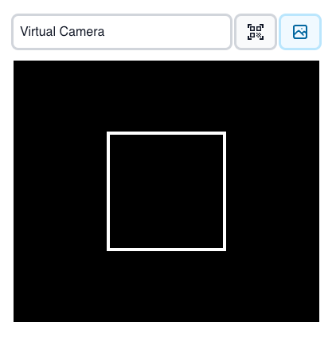

# Overview

The Qodly Scanner component is a versatile QR code scanner built using React and the `html5-qrcode` library. It allows users to scan QR codes using their device's camera and provides a seamless integration with the Qodly platform. The component supports various customization options, including frame rate, QR box size, and the ability to disable camera flipping.

## Properties

| Name         | Attribute     | Type    | Default | Description                                                                   |
| ------------ | ------------- | ------- | ------- | ----------------------------------------------------------------------------- |
| FPS          | `fps`         | number  | - 10    | The frame rate at which the camera captures frames for QR code scanning.      |
| QR Box Size  | `qrBoxSize`   | number  | 250     | The size of the box within which the QR code is scanned.                      |
| Disable Flip | `disableFlip` | boolean | `false` | Whether to disable the camera flip feature (useful for front-facing cameras). |

## Qodly Source

| Name        | Type   | Required | Description                         |
| ----------- | ------ | -------- | ----------------------------------- |
| qodlysource | string | Yes      | Will contain the result of scanning |
